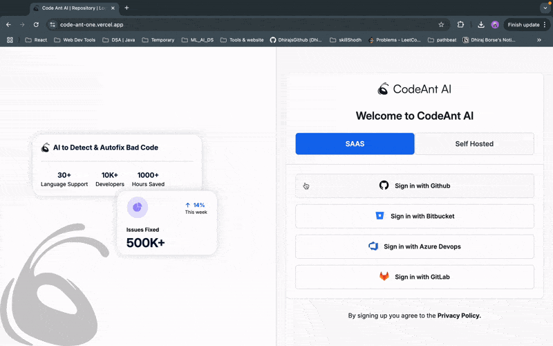
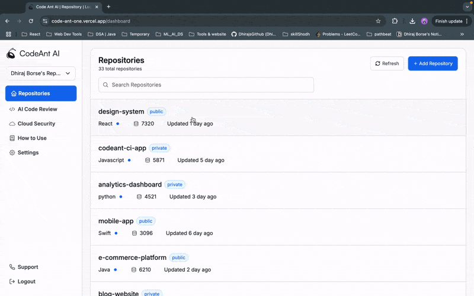

# Code-Ant

A modern React application built with Vite, TypeScript, and React Router DOM.

---

## Hosted Link

[Visit Code-Ant App](https://code-ant-one.vercel.app/)

---
## Demo Video Link
[Demo video link](https://drive.google.com/file/d/1gLjxg05wzpKgQRbZtbQP4IZNCS3frZdc/view?usp=sharing)


---

## How to Use

### 1. Login Page (`/`)
   - When you visit the application, you’ll start at the login page.
   - Click any **Sign In** button to log in and navigate to the dashboard.

### 2. Dashboard Page (`/dashboard`)
   - After logging in, you'll land on the dashboard.
   - Explore the dashboard features and functionalities.

### 3. Logout
   - Click the **Logout** button (available on the dashboard) to log out and return to the login page.

---

## Visual Guide 

### Login Page


### Dashboard Page


---

## Run the app locally with 4 simple steps:
## Prerequisites

Ensure you have the following installed on your system:

- **Node.js**: Version 20 or higher
- **npm**: Comes bundled with Node.js


## Installation

1. Clone the repository or download the source code:

   ```bash
   git clone https://github.com/DhirajsGithub/code-ant.git
    ```
   ```bash
   cd code-ant
   ```
2. Install the dependencies:
  
   ```bash
   npm install
   ```
3. Start the development server:

   ```bash
    npm run dev
    ```
4. Open the browser and navigate to `http://localhost:5173/` to view the application.


